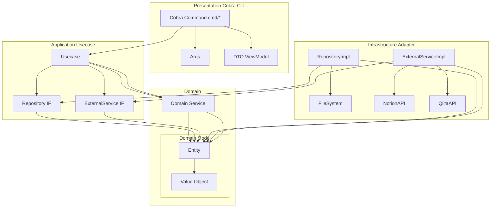

# Architecture

This product use Onion Architecture.

## Project Structure

```
main.go
├─infrastracture
│  ├─external
│  │ ├─notion
│  │ └─qiita
│  └─repository
│    └─filesystem
└─internal
    ├─presentation
    │  ├─cmd
    │  ├─dto
    │  └─args
    ├─domain
    │  ├─entity
    │  ├─valueobject
    │  └─service
    └─application
        ├─repository
        ├─external
        └─usecase
```

## Dependency diagram


